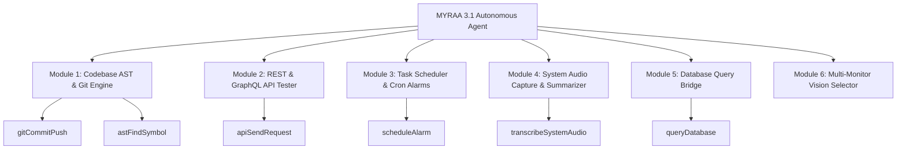

# MYRAA 3.1 — Complete Tool Capabilities & Autonomous Expansion Plan

> **Document Purpose**: Exhaustive technical analysis of the 56 active tools powering MYRAA & Ria, how tool invocation works across the Dual Process Model, and a strategic roadmap for adding next-generation autonomous capabilities.

---

## 1. How MYRAA & Ria Access Their 56 Tools

MYRAA & Ria operate on a **Dual-Layer Tool Architecture** combining real-time Gemini Live WebSocket function calling with a local Python FastAPI Desktop Control Agent.

```
┌─────────────────────────────────────────────────────────────────────────┐
│                           USER (Voice & Video)                          │
└────────────────────────────────────┬────────────────────────────────────┘
                                     │
                                     ▼
┌─────────────────────────────────────────────────────────────────────────┐
│               ELECTRON DESKTOP WINDOW & AUDIO ENGINE                    │
│                      (16kHz Mic In / 24kHz Audio Out)                   │
└────────────────────────────────────┬────────────────────────────────────┘
                                     │ WebSocket /live
                                     ▼
┌─────────────────────────────────────────────────────────────────────────┐
│                 EXPRESS NODE BACKEND (server.ts)                         │
│   • Manages Gemini Live WebSocket Session (gemini-2.0-flash-exp)        │
│   • Registers 56 FunctionDeclarations with Gemini Live API              │
│   • Receives toolCall events & routes execution                         │
└───────────────────┬─────────────────────────────────┬───────────────────┘
                    │                                 │
   Local JS / Web   │                                 │ HTTP REST POST
   Tool Handlers    │                                 │ (http://127.0.0.1:8765/execute)
                    ▼                                 ▼
┌──────────────────────────────┐    ┌───────────────────────────────────┐
│ Holographic Projector Tools  │    │ PYTHON DESKTOP AGENT (FastAPI)    │
│ • browserOpen, browserSearch │    │ • 46+ OS & Hardware Control Tools │
│ • changeBackground, Memories │    │ • PyAutoGUI, Playwright, OCR      │
└──────────────────────────────┘    └───────────────────────────────────┘
```

---

## 2. Complete Inventory of the 56 Active Tools

### A. Holographic Web Projector & Browser Agent (7 Tools)
Used by MYRAA & Ria to project websites, YouTube videos, and search results on screen.
1. **`browserOpen`**: Opens designated URLs (YouTube, Wikipedia, docs) inside the web projector.
2. **`browserSearch`**: Executes queries inside search inputs.
3. **`browserClick`**: Clicks links, buttons, and video cards.
4. **`browserMediaControl`**: Controls video playback (Play, Pause, Mute, Unmute, Volume, Fullscreen).
5. **`browserScroll`**: Scrolls web pages vertically up or down.
6. **`browserType`**: Inputs text into forms and textareas.
7. **`browserTabAction`**: Opens, closes, or switches active browser tabs.

### B. Visual Core & Companion Memory (3 Tools)
1. **`changeBackground`**: Shifts the UI color theme dynamically (`cyan`, `violet`, `gold`, `crimson`, `emerald`, `rose`, `charcoal`).
2. **`saveCustomMemory`**: Persists user facts, preferences, project details to `memories.json`.
3. **`fetchMemories`**: Retrieves stored long-term memories for contextual awareness.

### C. JARVIS-Class Desktop Control Agent (46 Tools)
Executed directly against Windows OS via Python FastAPI (`desktop_agent/main.py`):

#### 1. Application & Process Control
- **`openApplication`**: Launches applications (Notepad, VS Code, Chrome, Calculator, Terminal).
- **`closeApplication`**: Terminates running process instances.
- **`listRunningProcesses`**: Inspects active Windows tasks and PID details.

#### 2. Specialized Web & Engine Searches
- **`openWebsite`**: Direct launch of major web platforms.
- **`searchWeb`**: General web search via system default browser.
- **`searchYouTube`**: Direct video query on YouTube.
- **`searchGoogle`**: Instant Google Search query execution.
- **`searchGitHub`**: Repositories and code search on GitHub.

#### 3. File System Operations
- **`createFile`**: Creates files with initial text content.
- **`readFile`**: Reads text file contents.
- **`renameFile`**: Renames files or directories safely.
- **`deleteFile`**: Moves files to Windows Recycle Bin (with force override option).
- **`moveFile`**: Relocates files across directories.
- **`openFolder`**: Opens Explorer windows to specified folders (Desktop, Downloads, Documents).
- **`listFiles`**: Lists files and subdirectories with size metadata.
- **`searchFiles`**: Searches for files by extension or pattern.

#### 4. System Hardware & Power Management
- **`volumeUp` / `volumeDown` / `setVolume` / `muteToggle`**: Audio master volume control.
- **`brightnessUp` / `brightnessDown` / `setBrightness`**: Screen brightness adjustment.
- **`requestPowerAction` / `executePowerAction`**: Safe two-step token confirmation for Shutdown, Restart, Sleep, and Lock.

#### 5. Window & Desktop Workspace Management
- **`minimizeWindow` / `maximizeWindow` / `closeWindow`**: Controls active or named window state.
- **`switchApplication`**: Alt-Tab style focus switching.

#### 6. Clipboard & Text Operations
- **`copySelected`**: Simulates Ctrl+C and captures clipboard text.
- **`pasteClipboard`**: Sets clipboard content and simulates Ctrl+V.
- **`getClipboard` / `clearClipboard`**: Inspects or purges system clipboard.

#### 7. Multimodal Screen Vision & OCR
- **`takeScreenshot`**: Captures screen buffer.
- **`saveScreenshot`**: Saves screenshot to disk.
- **`analyzeScreenshot`**: OCR text extraction from whole screen via Tesseract.
- **`readScreen`**: Active window title + OCR text extraction.

#### 8. Playwright Desktop Browser Automation
- **`desktopBrowserOpen`**, **`desktopBrowserClick`**, **`desktopBrowserType`**, **`desktopBrowserFillForm`**, **`desktopBrowserBack`**, **`desktopBrowserForward`**, **`desktopBrowserScroll`**, **`desktopBrowserCloseTab`**: Autonomous headless/headful Playwright browser driver.

#### 9. Live Code Execution & Project Creation
- **`createPythonFile`**: Generates Python scripts.
- **`writeCodeFile`**: Writes code files in any programming language.
- **`createProjectFolder`**: Scaffold project folder structures.
- **`runPythonScript`**: Executes Python scripts natively and captures stdout/stderr.

#### 10. Hardware & Diagnostic Telemetry
- **`systemInfo`**: Reports CPU usage, RAM utilization, Disk space, and Uptime.
- **`gpuInfo`**: Reports GPU model, VRAM utilization, and temperature.
- **`temperatureInfo`**: System thermal telemetry.
- **`enableAutoStart` / `disableAutoStart` / `getAutoStartStatus`**: Windows boot startup registry configuration.

---

## 3. How Tool Invocation Works in Real-Time

```
Step 1: User Speaks -> "MYRAA, open Notepad and write 'Project Specs Ready'."
Step 2: Gemini Live API identifies intent and returns functionCall:
        openApplication(name: "notepad")
        createFile(path: "Desktop/notes.txt", content: "Project Specs Ready")
Step 3: server.ts receives functionCall and dispatches POST request to Desktop Agent:
        POST http://127.0.0.1:8765/execute { "tool": "openApplication", "args": { "name": "notepad" } }
Step 4: Desktop Agent executes OS command and returns { "ok": true, "result": "Notepad launched PID 3412" }
Step 5: server.ts sends functionResponse back into Gemini Live WebSocket stream.
Step 6: MYRAA/Ria speaks back in voice -> "I've opened Notepad and created your notes file on Desktop!"
```

---

## 4. Draft Expansion Plan: Next-Gen Autonomous Capabilities

To transform MYRAA & Ria into an extraordinary, fully autonomous engineer and OS companion, we propose adding **12 Advanced Tool Modules**:



### Proposed Next-Gen Tool Additions

1. **`gitCommitPush` & `gitBranchStatus`**:
   - Enables MYRAA & Ria to check `git status`, stage changes, author commits, and push to GitHub/GitLab directly.

2. **`astFindSymbol` & `codebaseIndexer`**:
   - Indexes entire codebases to find function definitions, class references, and imports in milliseconds across thousands of files.

3. **`apiSendRequest`**:
   - Executes arbitrary HTTP REST/GraphQL API calls (`GET`, `POST`, `PUT`, `DELETE`) with custom headers and body formatting, returning formatted JSON.

4. **`scheduleAlarm` & `cronTask`**:
   - Background scheduling allowing MYRAA to wake up, check server health, compile code, or remind the user at specific times.

5. **`transcribeSystemAudio`**:
   - Captures system output audio stream to transcribe Zoom meetings, YouTube videos, or podcasts in real-time.

6. **`queryDatabase`**:
   - Direct inspection and query execution for SQLite, PostgreSQL, MySQL, and MongoDB databases.

7. **`multiMonitorSelect`**:
   - Allows switching visual perception between Display 1, Display 2, or specific application windows.

8. **`packageManagerInstaller`**:
   - Allows autonomous installation of Python (`pip install`), Node (`npm install`), or system packages (`winget install`).

9. **`terminalCommandExecute`**:
   - Sandboxed background CLI command runner for PowerShell/CMD with real-time output streaming.

10. **`codeRefactorEngine`**:
    - Automatic multi-file diff generation and refactoring execution.

11. **`pdfReadExtract`**:
    - Native parsing and text extraction for PDF research papers and specifications.

12. **`systemHealthWatcher`**:
    - Background watcher that alerts the user if RAM/CPU exceeds 90% or a process crashes.

---

## 5. Summary & Next Steps

MYRAA & Ria currently hold **56 native tools** bridging real-time voice, vision, web projection, and local Windows automation. 

By executing the **Next-Gen Expansion Plan**, MYRAA & Ria will evolve from a voice desktop assistant into a **fully autonomous OS agent & engineering partner** capable of managing projects, running terminal workflows, and maintaining codebases independently.
